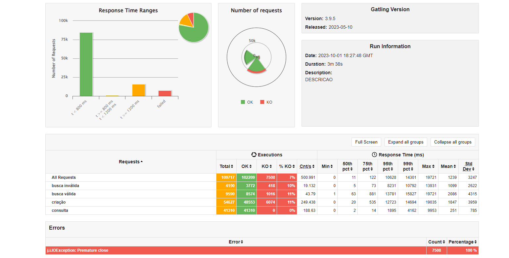
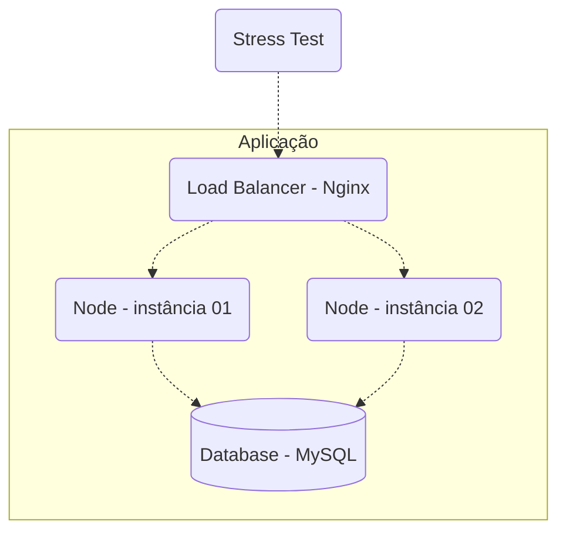

# Rinha backend 📚

<!---Esses são exemplos. Veja https://shields.io para outras pessoas ou para personalizar este conjunto de escudos. Você pode querer incluir dependências, status do projeto e informações de licença aqui--->
<h1>
  Tecnologias 👨‍💻
  </br>
  </br>
  <div align="center">
    
    
    
    
    
    
  </div>
</h1>

<p align="center">
  
</p>

> Resultado do teste de carga.

</br>

## 📂 Arquitetura - MSC (Controller -> Services -> Repository)

```
├── modules/
│ ├── person/
│ │ ├── controller/
│ │ │ ├── personController.ts
│ │ │
│ │ ├── service/
│ │ │ ├── personService.ts
│ │ │
│ │ ├── repository/
│ │ │ ├── personRepository.ts
`
```

## Infra



## ✔️ Requisitos Funcionais

## Endpoints

A API expõe 4 endpoints:

- `POST localhost:9999/pessoas` – para criar uma pessoa.
- `GET localhost:9999/pessoas/[:id]` – para consultar uma pessoa pelo id.
- `GET localhost:9999/pessoas?t=[:termo da busca]` – para fazer uma busca baseado em um termo de busca.
- `GET localhost:9999/contagem-pessoas` – endpoint que retornará uma contagem de pessoas inseridas na tabela.

<hr />

### Criar uma pessoa `POST /pessoas`

Para requisições válidas, A API deverá retornar status code 201 - created junto com o header "Location: /pessoas/[:id]" onde [:id] é o id – em formato UUID com a versão a seu critério – da pessoa que acabou de ser criada. O conteúdo do corpo fica a seu critério; retorne o que quiser.

Exemplos de requisições válidas:

```json
{
  "apelido": "josé",
  "nome": "José Roberto",
  "nascimento": "2000-10-01",
  "stack": ["C#", "Node", "Oracle"]
}
```

```json
{
  "apelido": "ana",
  "nome": "Ana Barbosa",
  "nascimento": "1985-09-23",
  "stack": null
}
```

Para requisições inválidas, o status code deve ser 422 - Unprocessable Entity/Content. Aqui, novamente, o conteúdo do corpo fica a seu critério.

Exemplos de requisições inválidas:

```json
{
  "apelido": "josé", // caso "josé" já tenha sido criado em outra requisição
  "nome": "José Roberto",
  "nascimento": "2000-10-01",
  "stack": ["C#", "Node", "Oracle"]
}
```

```json
{
  "apelido": "ana",
  "nome": null, // não pode ser null
  "nascimento": "1985-09-23",
  "stack": null
}
```

```json
{
  "apelido": null, // não pode ser null
  "nome": "Ana Barbosa",
  "nascimento": "1985-01-23",
  "stack": null
}
```

Para o caso de requisições sintaticamente inválidas, a resposta deverá ter o status code para 400 - bad request. Exemplos:

```json
{
  "apelido": "apelido",
  "nome": 1, // nome deve ser string e não número
  "nascimento": "1985-01-01",
  "stack": null
}
```

```json
{
  "apelido": "apelido",
  "nome": "nome",
  "nascimento": "1985-01-01",
  "stack": [1, "PHP"] // stack deve ser um array de apenas strings
}
```

<hr />

### Detalhe de uma Pessoa `GET /pessoas/[:id]`

Deverá retornar os detalhes de uma pessoa caso esta tenha sido criada anteriormente. O parâmetro [:id] deve ser do tipo UUID na versão que escolher. O retorno deve ser como os exemplos a seguir.

```json
{
  "id": "f7379ae8-8f9b-4cd5-8221-51efe19e721b",
  "apelido": "josé",
  "nome": "José Roberto",
  "nascimento": "2000-10-01",
  "stack": ["C#", "Node", "Oracle"]
}
```

```json
{
  "id": "5ce4668c-4710-4cfb-ae5f-38988d6d49cb",
  "apelido": "ana",
  "nome": "Ana Barbosa",
  "nascimento": "1985-09-23",
  "stack": null
}
```

Note que a resposta é praticamente igual ao payload de criação com o acréscimo de `id`. O status code para pessoas que existem deve ser 200 - Ok. Para recursos que não existem, deve-se retornar 404 - Not Found.

<hr />

### Busca de Pessoas `GET /pessoas?t=[:termo da busca]`

Dado o `termo da busca`, a resposta deverá ser uma lista que satisfaça o termo informado estar contido nos atributos `apelido`, `nome`, e/ou elementos de `stack`. A busca não precisa ser paginada e poderá retornar apenas os 50 primeiros registros resultantes da filtragem para facilitar a implementação.

O status code deverá ser sempre 200 - Ok, mesmo para o caso da busca não retornar resultados (vazio).

Exemplos: Dado os recursos seguintes existentes em sua aplicação:

```json
[
  {
    "id": "f7379ae8-8f9b-4cd5-8221-51efe19e721b",
    "apelido": "josé",
    "nome": "José Roberto",
    "nascimento": "2000-10-01",
    "stack": ["C#", "Node", "Oracle"]
  },
  {
    "id": "5ce4668c-4710-4cfb-ae5f-38988d6d49cb",
    "apelido": "ana",
    "nome": "Ana Barbosa",
    "nascimento": "1985-09-23",
    "stack": ["Node", "Postgres"]
  }
]
```

Uma requisição `GET /pessoas?t=node`, deveria retornar o seguinte:

```json
[
  {
    "id": "f7379ae8-8f9b-4cd5-8221-51efe19e721b",
    "apelido": "josé",
    "nome": "José Roberto",
    "nascimento": "2000-10-01",
    "stack": ["C#", "Node", "Oracle"]
  },
  {
    "id": "5ce4668c-4710-4cfb-ae5f-38988d6d49cb",
    "apelido": "ana",
    "nome": "Ana Barbosa",
    "nascimento": "1985-09-23",
    "stack": ["Node", "Postgres"]
  }
]
```

Uma requisição `GET /pessoas?t=berto`, deveria retornar o seguinte:

```json
[
  {
    "id": "f7379ae8-8f9b-4cd5-8221-51efe19e721b",
    "apelido": "josé",
    "nome": "José Roberto",
    "nascimento": "2000-10-01",
    "stack": ["C#", "Node", "Oracle"]
  }
]
```

Uma requisição `GET /pessoas?t=Python`, deveria retornar o seguinte:

```json
[]
```

<strong>Se a query string `t` não for informada, a resposta deve ter seu status code para 400 - bad request com o corpo que quiser. Ou seja, informar `t` é obrigatório.</strong>

### Contagem de Pessoas `GET /contagem-pessoas`

Este é um endpoint especial que NÃO SERÁ TESTADO (portanto, não se preocupe com sua performance) e deverá retornar em texto puro o número de registros de pessoas e qq status code na faixa de 2XX. Ele será usado para validar o número de requisições de criação bem sucedidas durante o teste de stress, por isso não use cache ou qualquer outra forma de materialização que seja eventualmente consistente.

<br >

## 🖖🏼 Objetivo

Criar um projeto escalável, para suportar centenas de requisições por segundo, atendendo o maior numero de pessoas possível com a maxima eficiência possível.

## 💻 Pré-requisitos

Antes de começar, verifique se você atendeu aos seguintes requisitos:

- Ter instalado o Docker instalado.
- Verificar se não tem nenhum processo rodando nas portas: <strong>3000</strong>, <strong>3001</strong>, <strong>9999</strong>, <strong>6379</strong>

## 🚀 Rodando o projeto

<strong>Certifique-se de estar na raiz do projeto</strong>

</br>

```shell
  docker compose up --build
```
